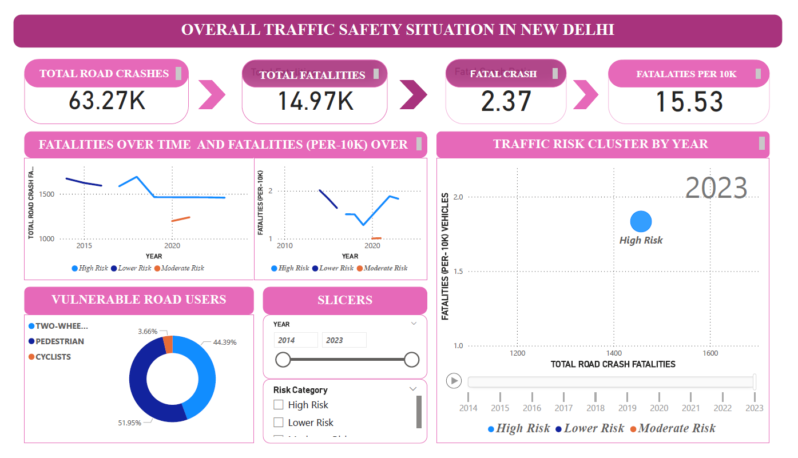

# 🚦 Traffic Mortality Analysis – New Delhi

## 📌 Project Overview
This project analyzes traffic crash data from New Delhi to identify trends in road crashes, fatalities, vulnerable road users, and high-risk vehicle categories. The goal is to provide data-driven insights that can support road safety policy and enforcement decisions.

## 🎯 Objectives
- Analyze long-term trends in road crashes and fatalities
- Identify high-risk years using clustering (KMeans)
- Measure crash severity using fatal crash ratios
- Analyze vulnerable road users (pedestrians, cyclists, two-wheelers)
- Compare fatal crash rates across vehicle types
- Build an interactive Power BI dashboard for storytelling

## 🛠️ Tools & Technologies
- Python (Pandas, NumPy, Scikit-learn)
- Jupyter Notebook
- Power BI
- Git & GitHub

## 📊 Key Analysis
- Regression Analysis: Relationship between vehicle growth and fatalities  
- KMeans Clustering: Risk-based year classification (High / Moderate / Low)
- Feature Engineering: Fatal crash ratio, fatalities per 10k vehicles
- Visualization: Interactive multi-page Power BI dashboard

## 📈 Dashboard Pages
1. Overall Traffic Safety Overview
2. Risk & Cluster Analysis
3. Vulnerable Road Users
4. Vehicle Type & Crash Severity Analysis

## 📂 Repository Structure
See the folder structure above for data, notebooks, Power BI files, and visuals.

## 📸 Dashboard Preview

## 🔍 Key Insights
- Vulnerable road users account for a majority of traffic fatalities
- High-risk years show increased fatality rates despite fewer crashes
- Heavy and commercial vehicles exhibit higher crash severity
- Crash severity is increasing even when total crashes decline

## 🚀 Outcome
This project demonstrates end-to-end data analytics skills including data cleaning, feature engineering, machine learning, and business-focused dashboarding.

MIT © Gaurav Dogra
---
